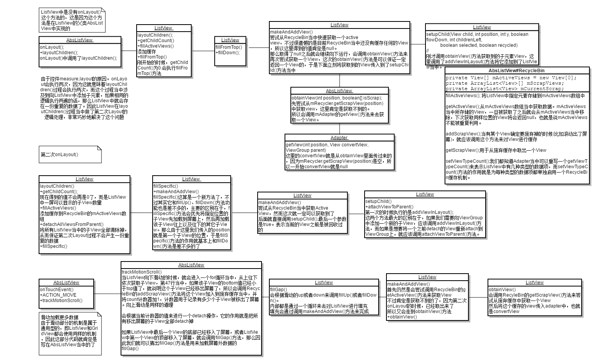

## ListView

* [Android ListView工作原理完全解析，带你从源码的角度彻底理解](http://blog.csdn.net/guolin_blog/article/details/44996879)

## RecyclerView
众所周知，android控件的绘制可以分为3个步骤：measure、layout、draw。RecyclerView的绘制自然也经这3个步骤。  
但是，RecyclerView将它的measure与layout过程委托给了RecyclerView.LayoutManager来处理，并且，它对子控件的measure及layout过程是逐个处理的，也就是说，执行完成一个子控件的measure及layout过程再去执行下一个。

* [RecyclerView源码分析](http://mouxuejie.com/blog/2016-03-06/recyclerview-analysis/)
* [RecyclerView剖析](http://blog.csdn.net/qq_23012315/article/details/50807224)
* [安卓5.1源码解析 : RecyclerView解析 从绘制流程,ViewHolder复用机制,LayoutManger,ItemAnimator等流程全面讲解](http://blog.csdn.net/hfyd_/article/details/53910631?_t_t_t=0.81394347618334)

## ListView の RecyclerView 对比
### 缓存机制对比

* [Android ListView与RecyclerView对比浅析--缓存机制](http://dev.qq.com/topic/5811d3e3ab10c62013697408)
* [RecyclerView 和 ListView 使用对比分析](http://www.jianshu.com/p/f592f3715ae2)
